# Foodie-Fi (SQL case study)


## The Guide

I use Microsoft SQL Sever for this case study walkthrough

1. Create a database
2. Run ```schema.sql``` file in the database
3. Use ```solutions.sql``` file to check the solutions

## The Relationship Diagram
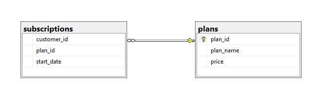

## Questions
1. How many customers has Foodie-Fi ever had?
2. What is the monthly distribution of trial plan start_date values for our dataset - use the start of the month as the group by value
3. What plan start_date values occur after the year 2020 for our dataset? Show the breakdown by count of events for each plan_name
4. What is the customer count and percentage of customers who have churned rounded to 1 decimal place?
5. How many customers have churned straight after their initial free trial - what percentage is this rounded to the nearest whole number?
6. What is the number and percentage of customer plans after their initial free trial?
7. What is the customer count and percentage breakdown of all 5 plan_name values at 2020-12-31?
8. How many customers have upgraded to an annual plan in 2020?
9. How many days on average does it take for a customer to an annual plan from the day they join Foodie-Fi?
10. Can you further breakdown this average value into 30 day periods (i.e. 0-30 days, 31-60 days etc)
11. How many customers downgraded from a pro monthly to a basic monthly plan in 2020?

## Solutions

**1. How many customers has Foodie-Fi ever had?**

``` bash
SELECT COUNT(DISTINCT customer_id) AS Number_of_customer
FROM subscriptions;
```

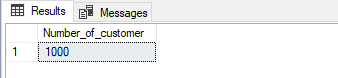

**2. What is the monthly distribution of trial plan start_date values for our dataset - use the start of the month as the group by value**

``` bash
SELECT MONTH(s.start_date) AS month, COUNT(s.customer_id) AS number_of_trial
FROM subscriptions s
LEFT JOIN plans p ON s.plan_id = p.plan_id
WHERE p.plan_name = 'trial'
GROUP BY MONTH(s.start_date)
ORDER BY MONTH(s.start_date);
```

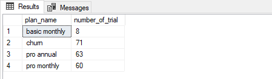

**3. What plan start_date values occur after the year 2020 for our dataset? Show the breakdown by count of events for each plan_name**

``` bash
SELECT p.plan_name, COUNT(s.customer_id) AS number_of_trial
FROM subscriptions s
LEFT JOIN plans p ON s.plan_id = p.plan_id
WHERE YEAR(s.start_date) > 2020
GROUP BY p.plan_name;
```

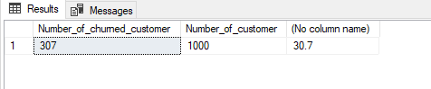

**4. What is the customer count and percentage of customers who have churned rounded to 1 decimal place?**

``` bash
WITH num_of_cus AS (
    SELECT COUNT(DISTINCT customer_id) AS Number_of_customer
    FROM subscriptions
),
num_of_churned_cus AS (
    SELECT COUNT(DISTINCT customer_id) AS Number_of_churned_customer
    FROM subscriptions s
    LEFT JOIN plans p ON s.plan_id = p.plan_id
    WHERE p.plan_name = 'churn'
)
SELECT Number_of_churned_customer, Number_of_customer,
CAST(Number_of_churned_customer AS FLOAT) * 100 / CAST(Number_of_customer AS FLOAT) AS churn_percentage
FROM num_of_cus, num_of_churned_cus;
```


**5. How many customers have churned straight after their initial free trial - what percentage is this rounded to the nearest whole number?**

``` bash
WITH CTE AS (
    SELECT *, 
    LEAD(plan_id, 1) OVER (PARTITION BY customer_id ORDER BY plan_id) AS next_plan
    FROM subscriptions
)
SELECT p.plan_name, COUNT(c.next_plan) AS number_churn, 
CAST(COUNT(c.next_plan) AS FLOAT) * 100 / (SELECT COUNT(DISTINCT customer_id) FROM subscriptions) AS perc_straight_churn
FROM CTE c
LEFT JOIN plans p ON c.next_plan = p.plan_id
WHERE c.next_plan = 4 AND c.plan_id = 0
GROUP BY p.plan_name;
```

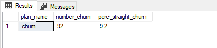

**6. What is the number and percentage of customer plans after their initial free trial?**

``` bash
WITH CTE AS (
    SELECT *, 
    LEAD(plan_id, 1) OVER (PARTITION BY customer_id ORDER BY plan_id) AS next_plan
    FROM subscriptions
)
SELECT p.plan_name, COUNT(*) AS num_plan,
CAST(COUNT(c.next_plan) AS FLOAT) * 100 / (SELECT COUNT(DISTINCT customer_id) FROM subscriptions) AS perc_next_plan
FROM CTE c
LEFT JOIN plans p ON c.next_plan = p.plan_id
WHERE c.plan_id = 0 AND c.next_plan IS NOT NULL
GROUP BY p.plan_name, c.next_plan;
```

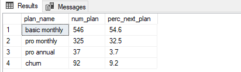

**7. What is the customer count and percentage breakdown of all 5 plan_name values at 2020-12-31?**

``` bash
WITH CTE AS (
    SELECT *, 
    LEAD(start_date, 1) OVER (PARTITION BY customer_id ORDER BY plan_id) AS next_date
    FROM subscriptions
    WHERE start_date <= '2020-12-31'
)
SELECT c.plan_id, p.plan_name, COUNT(c.plan_id) AS customer_count,
(CAST(COUNT(c.plan_id) AS FLOAT) * 100 / (SELECT COUNT(DISTINCT customer_id) FROM subscriptions)) AS Percentage_customer
FROM CTE c
LEFT JOIN plans p ON c.plan_id = p.plan_id
WHERE c.next_date IS NULL OR c.next_date > '2020-12-31'
GROUP BY c.plan_id, p.plan_name
ORDER BY c.plan_id;
```

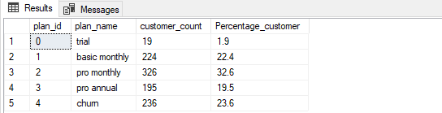

**8. How many customers have upgraded to an annual plan in 2020?**

``` bash
SELECT p.plan_name, COUNT(s.plan_id) AS number_annual_plan
FROM subscriptions s
INNER JOIN plans p ON s.plan_id = p.plan_id
WHERE p.plan_name = 'pro annual' AND s.start_date <= '2020-12-31'
GROUP BY p.plan_name;
```

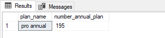

**9. How many days on average does it take for a customer to an annual plan from the day they join Foodie-Fi?**

``` bash
WITH START_CTE AS (
    SELECT s.customer_id, s.start_date
    FROM subscriptions s
    INNER JOIN plans p ON s.plan_id = p.plan_id
    WHERE p.plan_name = 'trial'
),
ANNUAL_CTE AS (
    SELECT s.customer_id, s.start_date AS start_annual
    FROM subscriptions s
    INNER JOIN plans p ON s.plan_id = p.plan_id
    WHERE p.plan_name = 'pro annual'
)
SELECT AVG(DATEDIFF(DAY, c1.start_date, c2.start_annual)) AS average_day
FROM ANNUAL_CTE c2
LEFT JOIN START_CTE c1 ON c2.customer_id = c1.customer_id;
```

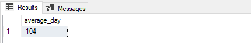

**10. Can you further breakdown this average value into 30 day periods (i.e. 0-30 days, 31-60 days etc)**

``` bash
WITH START_CTE AS (
    SELECT s.customer_id, s.start_date
    FROM subscriptions s
    INNER JOIN plans p ON s.plan_id = p.plan_id
    WHERE p.plan_name = 'trial'
),
ANNUAL_CTE AS (
    SELECT s.customer_id, s.start_date AS start_annual
    FROM subscriptions s
    INNER JOIN plans p ON s.plan_id = p.plan_id
    WHERE p.plan_name = 'pro annual'
),
DIFF_DAY_CTE AS (
    SELECT DATEDIFF(DAY, c1.start_date, c2.start_annual) AS diff_day
    FROM ANNUAL_CTE c2
    LEFT JOIN START_CTE c1 ON c2.customer_id = c1.customer_id
),
GROUP_DAY_CTE AS (
    SELECT *, FLOOR(diff_day / 30) AS group_day
    FROM DIFF_DAY_CTE
)
SELECT CONCAT((group_day * 30) + 1, '-', (group_day + 1) * 30, ' days') AS days,
COUNT(group_day) AS number_days
FROM GROUP_DAY_CTE
GROUP BY group_day;
```

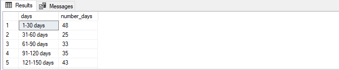

**11. How many customers downgraded from a pro monthly to a basic monthly plan in 2020?**

``` bash
WITH CTE AS (
    SELECT *, 
    LEAD(plan_id, 1) OVER (PARTITION BY customer_id ORDER BY plan_id) AS next_plan
    FROM subscriptions
    WHERE start_date <= '2020-12-31'
)
SELECT COUNT(*) AS num_downgrade
FROM CTE
WHERE next_plan = 1 AND plan_id = 2;
```

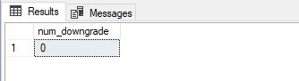